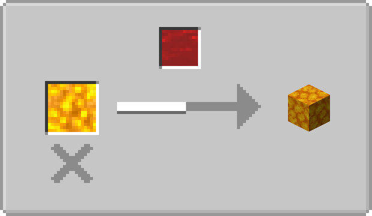

# Skyland Utils

[](https://www.gnu.org/licenses/agpl-3.0.html)
[](https://github.com/ruifengx/skyland-utils/actions/workflows/gradle.yaml)


Utilities for survival on skylands with [Create 0.3](https://github.com/Creators-of-Create/Create)
and [Tinker's Construct 3](https://github.com/SlimeKnights/TinkersConstruct).

## Overview

- [x] Fluid behaviours
    - [x] Hot fluids behave like lava
        - [x] `skyland-utils:scalding`: Cause damage to entities
        - [x] `skyland-utils:igniting`: Ignites entities
        - [x] `skyland-utils:ultra_warm`: Flow distance determined by world type (ultrawarm: 8, other: 4)
    - [x] Cool fluids behave like water
        - [x] `skyland-utils:vaporizing`: Vaporize in ultrawarm worlds
        - [x] `skyland-utils:clear_fire`: Extinguishes entities
    - [x] `forge:buckets`: Can be placed by dispenser
    - [x] Fluids push entities
- [x] Customizable fluid interactions
    - [x] Blood → Blazing blood ⇒ Netherrack
    - [x] Cool fluid → Blazing blood (Source) ⇒ Blaze Block
    - [x] Customizable as recipe type `skyland-utils:fluid_interation`

## JEI Screenshots

Skyland Utils support JEI, below are some screenshots.

| Cobblestone | Blaze Block |
|---|-------|
|  |  |

| Obsidian | Basalt |
|---|-------|
|  |  |

## Customize

All modifications are customizable via [data packs](https://minecraft.fandom.com/wiki/Data_Pack).

### Fluid Tag Example

To add more fluids which allows swimming, use `data/skyland-utils/tags/fluid/allow_swimming.json` (below are the default values):

```json
{
  "replace": "false",
  "values": [
    "#minecraft:water",
    "#tconstruct:blood",
    "#tconstruct:slime"
  ]
}
```

### Interaction Recipe Example

To add more custom fluid interactions, use `data/*/recipes/**/*.json` (below is the content for vanilla basalt generation):

```json
{
  "type": "skyland-utils:fluid_interation",
  "consume": "#minecraft:lava",
  "env": [
    {"block": "minecraft:blue_ice"}
  ],
  "below": "minecraft:soul_soil",
  "generate": "minecraft:basalt"
}
```

## License

This project is licensed under the _GNU Affero General Public License_ as published by the _Free Software Foundation_,
either version 3 of the License, or (at your option) any later version.
