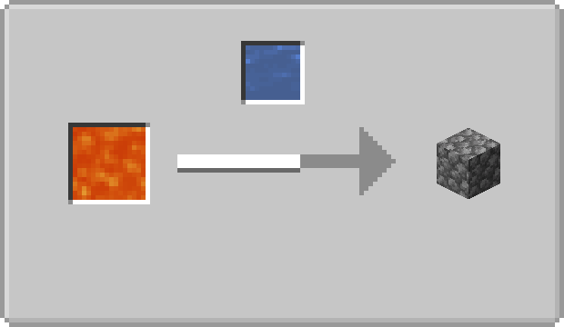
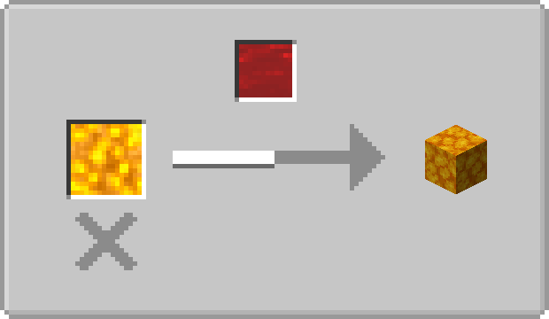
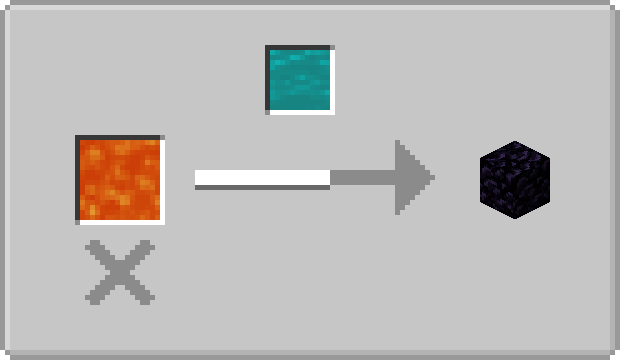
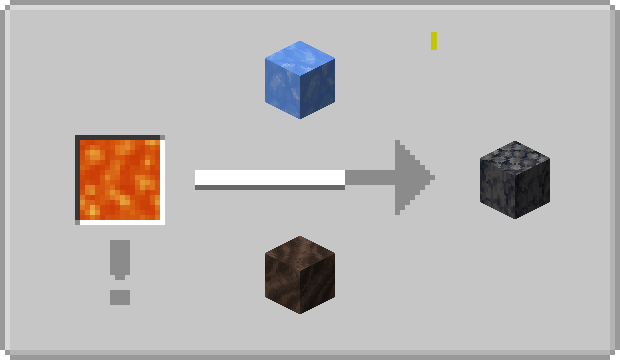

# 空岛实用拓展

[](https://www.gnu.org/licenses/agpl-3.0.html)
[](https://github.com/ruifengx/skyland-utils/actions/workflows/gradle.yaml)


为 [机械动力0.3](https://github.com/Creators-of-Create/Create) 和 [匠魂3](https://github.com/SlimeKnights/TinkersConstruct) 设计的空岛生存实用拓展。

## 概览

- [x] 流体行为
    - [x] 热流体具有类似熔岩（`minecraft:lava`）的行为
        - [x] `skyland-utils:scalding`：对实体造成烫伤
        - [x] `skyland-utils:igniting`：点燃实体
        - [x] `skyland-utils:ultra_warm`：流体流动的最大距离按照世界类型确定
            - 普通世界（如主世界和末地）：4
            - 强热世界（如下界）：8
    - [x] 冷流体具有类似水（`minecraft:water`）的行为
        - [x] `skyland-utils:vaporizing`：在强热世界会蒸发
        - [x] `skyland-utils:clear_fire`：熄灭火焰
    - [x] `forge:buckets`：发射器能使用这个桶放置流体
    - [x] 所有流体都能推动实体
- [x] 可自定义的流体反应
    - [x] 血 → 烈焰血 ⇒ 下界岩
    - [x] 冷流体 → 烈焰血（流体源） ⇒ 烈焰块
    - [x] 可使用配方类型`skyland-utils:fluid_interaction`来自定义

## JEI 屏幕截图

空岛使用拓展提供了对 [Just Enough Items (JEI)](https://github.com/mezz/JustEnoughItems) 的基本支持，下面是一些屏幕截图：

| 圆石 | 烈焰块 |
|---|-------|
|  |  |

| 黑曜石 | 玄武岩 |
|---|-------|
|  |  |

## 自定义

所有的改动都可通过 [数据包](https://minecraft.fandom.com/zh/wiki/%E6%95%B0%E6%8D%AE%E5%8C%85) 来自定义。

### 例子：流体标签

为了设置更多流体允许游泳，应该把流体ID添加到`data/skyland-utils/tags/fluid/allow_swimming.json`这个文件（下面是模组中的默认设置）。

```json
{
  "replace": "false",
  "values": [
    "#minecraft:water",
    "#tconstruct:blood",
    "#tconstruct:slime"
  ]
}
```

### 例子：流体反应合成表

为了添加更多自定义的流体反应，可以使用`skyland-utils:fluid_interaction`这个合成表类型。文件应当添加到`data/*/recipes/**/*.json`（下面是原版生成玄武岩的配方）。

```json
{
  "type": "skyland-utils:fluid_interation",
  "consume": "#minecraft:lava",
  "env": [
    {"block": "minecraft:blue_ice"}
  ],
  "below": "minecraft:soul_soil",
  "generate": "minecraft:basalt"
}
```

## 协议

本项目遵循*自由软件基金会*发布的*GNU Affero General Public License*协议，您可以自由选择其版本3或任何后续版本。
